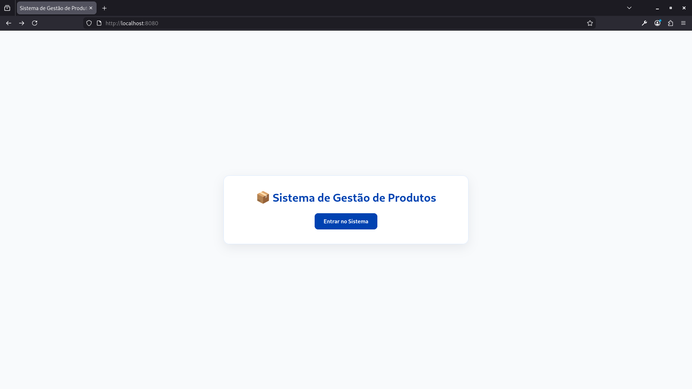
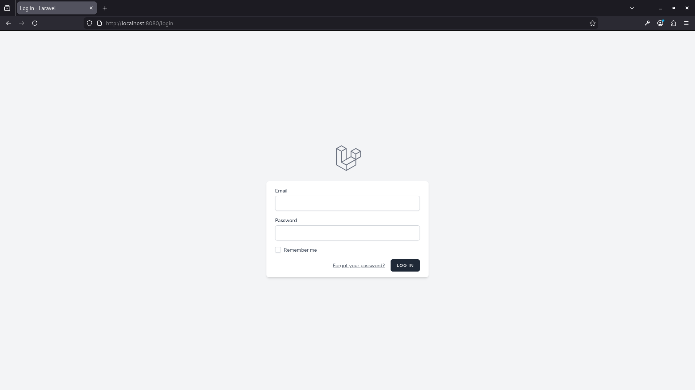
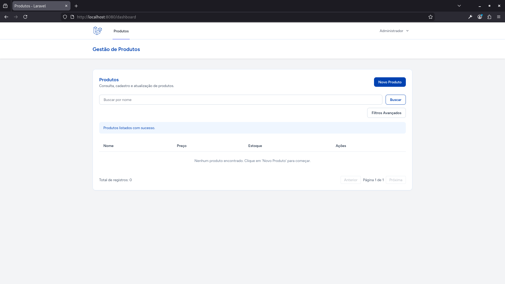
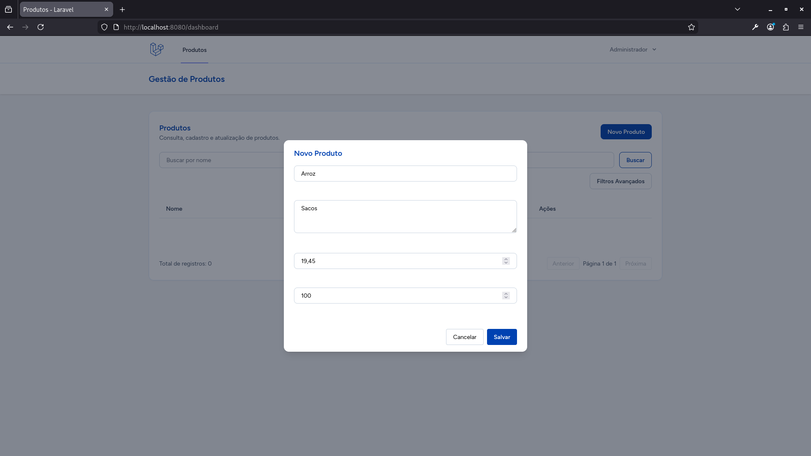
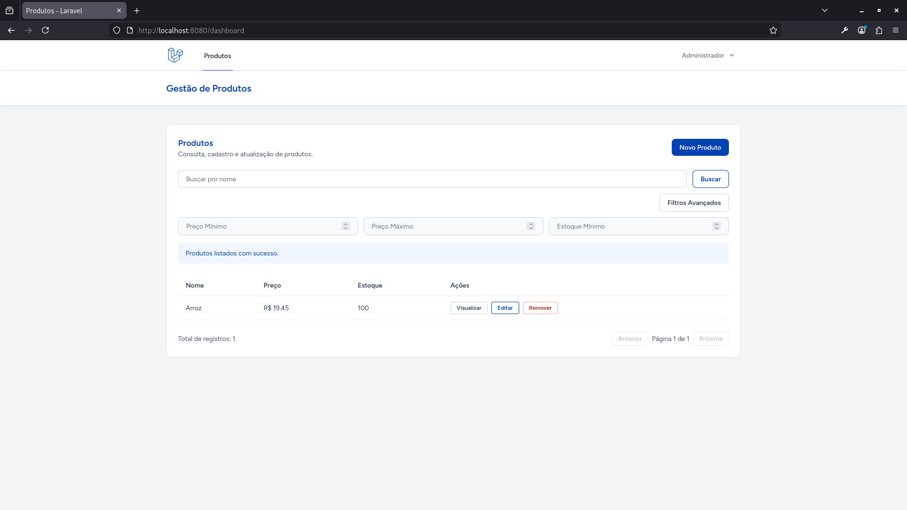
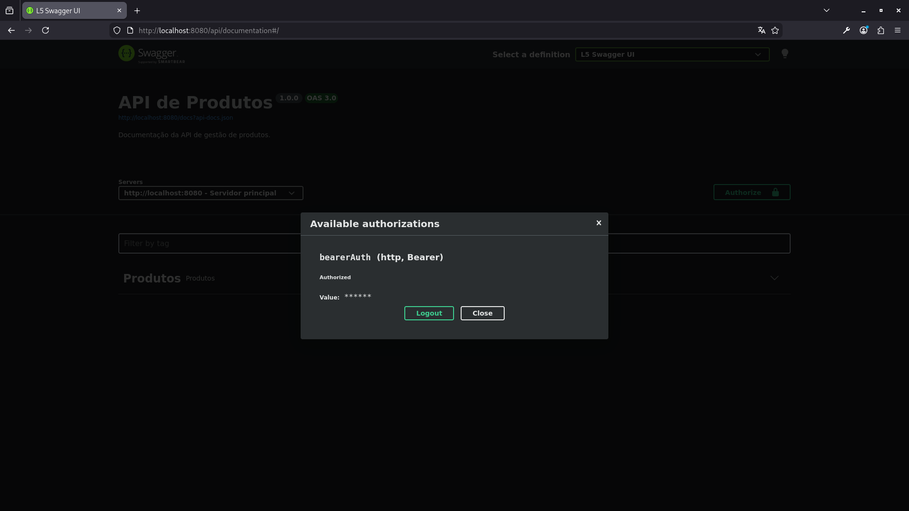
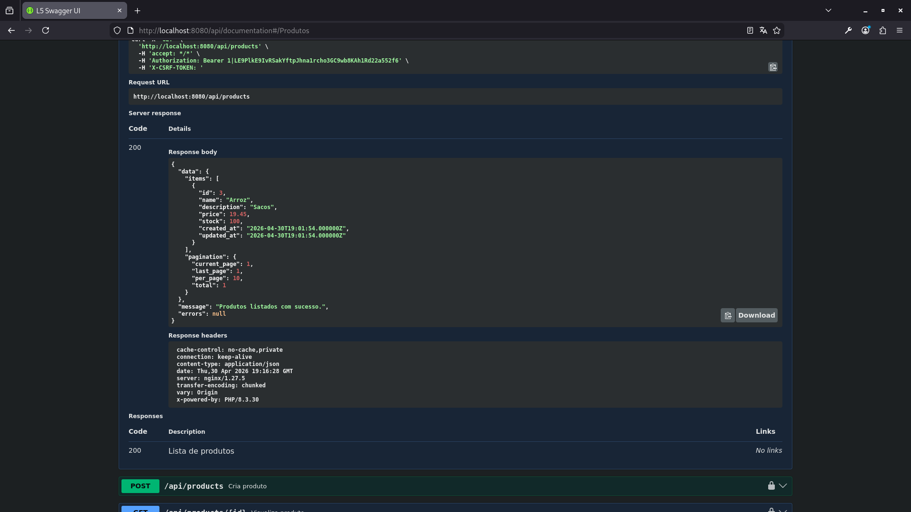

# 📦 Gerenciamento de Produtos - Desafio Técnico

Este projeto é uma aplicação Full-Stack para gerenciamento de produtos, com foco em **Arquitetura Limpa**, **SOLID** e **Segurança**. A solução entrega CRUD completo com interface web e API RESTful protegida.

## 🏛️ Arquitetura e Diferenciais Técnicos

- **Repository Pattern:** desacoplamento da persistência via `ProductRepositoryInterface`.
- **Service Layer:** regras de negócio centralizadas na `ProductService`.
- **Segurança:** autenticação com **Laravel Breeze (Web)** e **Sanctum (API)**.
- **Validação:** uso de `FormRequest` para regras de entrada.
- **PestPHP:** testes de Feature e Unit cobrindo fluxo principal.
- **Documentação Swagger:** endpoints documentados com suporte a autenticação Bearer.
- **Monitoramento:** Redis e Worker para filas (Queues/Jobs).

## 🚀 Tecnologias Utilizadas

- **Backend:** PHP 8.3 + Laravel 11
- **Frontend:** Vue 3 (Composition API) + Inertia.js + Pinia
- **Infra:** Docker & Docker Compose (Nginx, MySQL, Redis)
- **Testes:** PestPHP
- **UI/UX:** estética baseada no padrão Gov.br

## 🛠️ Como Executar o Projeto

**Pré-requisitos:** [Docker](https://docs.docker.com/get-docker/) com plugin **Docker Compose V2** (`docker compose`), Git, e as portas **8080** (HTTP), **3306** e **6379** livres no host (mapeadas pelo Compose).

### 1. Clonar e acessar

O Git cria uma pasta com o **nome do repositório** (`First`). Se você clonou para outro diretório, use esse nome no `cd`.

```bash
git clone git@github.com:maaclrd/First.git
cd First
```

### 2. Subir infraestrutura

```bash
docker compose up -d --build
```

Aguarde alguns segundos na primeira execução para o MySQL ficar pronto antes dos comandos Artisan abaixo.

### 3. Configuração inicial (no container `app`)

Instale dependências PHP/Node e gere o `.env`:

```bash
docker compose exec app sh -lc "composer install && npm install"
docker compose exec app sh -lc "cp .env.example .env && php artisan key:generate"
docker compose exec app chown -R www-data:www-data storage bootstrap/cache
```

### 4. Banco, front-end e documentação

```bash
docker compose exec app sh -lc "php artisan migrate --force --seed"
docker compose exec app sh -lc "npm run build"
docker compose exec app sh -lc "php artisan l5-swagger:generate"
```

### 5. Credenciais de avaliação (seed padrão)

- **E-mail:** `admin@example.com`
- **Senha:** `password`

## 🚀 Atalho: Configuração Rápida

Para executar de uma vez os passos 3, 4 e 5:

```bash
docker compose exec app sh -lc "composer install && npm install && cp .env.example .env && php artisan key:generate && chown -R www-data:www-data storage bootstrap/cache && php artisan migrate --force --seed && npm run build && php artisan l5-swagger:generate"
```

## 🔐 Autenticação da API (Swagger)

Para testar endpoints protegidos:

1. Acesse `http://localhost:8080/login` com o usuário padrão ou registre um novo usuário.
2. Gere um token Sanctum para o usuário autenticado (Tinker ou endpoint dedicado de login/token).
3. Abra `http://localhost:8080/api/documentation`.
4. Clique em **Authorize** e informe `Bearer <seu_token>`.

## 🔗 Endpoints Principais

- Aplicação Web: http://localhost:8080
- Documentação Swagger: http://localhost:8080/api/documentation

## ✅ Testes Automatizados

```bash
docker compose exec app sh -lc "php artisan test"
```
## 📸 Screenshots

| Listagem e Filtros | Cadastro de Produtos |
|---|---|
|  |  |
|  |  |
|  |  |

### 🛠️ API Documentation (Swagger)
| Token | Listagem |
|---|---|
|  |  |